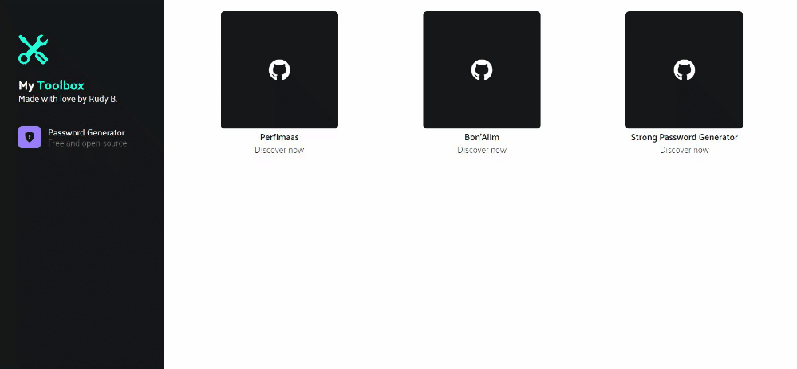

<h1 align="center">MyToolBox</h1>


<p align="center">🛠️ 🧰</p>

**MyToolBox** is a free and open source collection of small and easy to use tools and personal projects.

<p align="center">
  
</p>

## ✨ Features

 - [X] Listing my mains GitHub projects
 - [X] Password Generator Tool

## Getting started

### Install dependencies
```bash
npm install
# or
yarn install
```

### Run the server
```bash
npm run start
# or
yarn start
```

## Contributing

Heeey! I am very happy to know that you are considering contributing to MyToolBox! If you think anything is missing or could be improved, please open the issues and fill in your suggestions or requests. If you want to make this project grow, I will be happy to have your help!

## 💌 Contact

Feel free to contact me about any questions you may have:
* At [btte.rudy@gmail.com](mailto:btte.rudy@gmail.com)
* By opening an issue.

MyToolBox is developed by [Rudy Boutte](https://github.com/boutterudy), a young passionate developer. Any suggestion or feedback is highly appreciated. Thank you for your support!